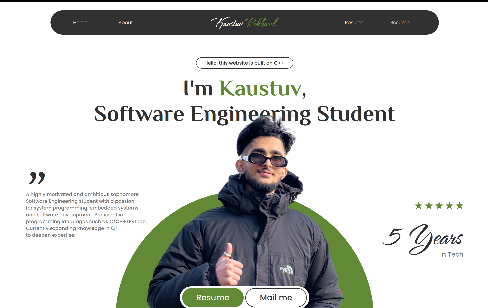

# Portfolio Website With QT/QML/C++

This is a portfolio website created using QML/Qt/C++ and deployed via WebAssembly. 
A year ago I had a an idea of building my website with C++, but I didn't know how. I didn't know about Qt or any tools, just the basics of C++. A year later, today,
I completed the 1st verison of the site. 
Here is the link to the preview of the work, before being deployed;


## Click the Image to watch the Preview Video 👇
[](https://www.youtube.com/watch?v=EECYd3PjoiY)


## Features

- **Smooth Design**: Even though it's built as a qtQuick application, the design is smooth as any regular website format with workable frontend.

- **PDF Resume Viewer**: A feature that allows visitors to view and download my resume in PDF format.


## Getting Started

### Prerequisites

- Qt SDK: Ensure you have the necessary Qt development environment set up on your machine. You can download it from [Qt's official website](https://www.qt.io/download).
  
### Build and Run

1. Clone the repository:

    ```bash
    [https://github.com/kastuv/PortfolioWebiste-QT-Cpp.git]
    ```

2. Open the project in Qt Creator.

3. Configure your build settings for WebAssembly.

4. Build and run the project.

### Deployment
 1. Under deployment:


    You can follow Qt documentation for Web-assembly.
    [Qt for webassembly](https://doc.qt.io/qt-6/wasm.html)
    
    Install external libraries **Emscripten**
    [Emcripten](https://emscripten.org/docs/getting_started/downloads.html)

    Make sure what Qt version you're using to make it work!

## Customization

Feel free to customize the content, styles, and structure of the website to better suit your preferences and for your unique identity.

## Technologies Used

- QT
- QML
- Qt WebAssembly

## License

This project is licensed under the [MIT License](LICENSE.md).

## Acknowledgments

Special thanks to the Qt-Group for amazing documentations and Qt-reddit community.

## Contact

For inquiries or feedback, you can reach me at kastuvpokharel@gmail.com.

Happy coding!
